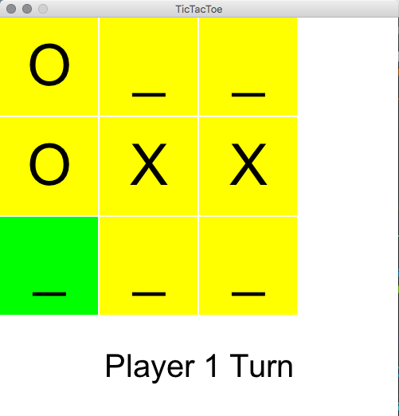

# Tic-Tac-Toe demonstration

This is a simple, 2D Tic-Tac-Toe game with states for both cells and the overall gameplay represented as enums, which is a new Java feature for us that is useful for turn based games and managing game states.
